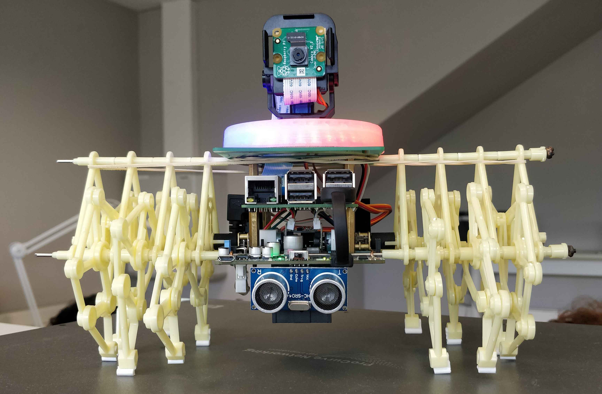

# **Starflit: the Strandbeest fleet**

## **Introduction**

Welcome to the **Starflit** project!

This project aims to develop a fleet of autonomous robots capable of locating and rescuing individuals in disaster-stricken areas.

*A single Strandbeest*

## **Project Principle**

Our fleet of robots is designed to operate in unknown and hazardous environments, where human rescue teams cannot operate.
Their mission consists in:

- **Exploring**: explore an unknown environment while avoiding collisions.
- **Detecting**: use the camera and AI to identify the presence of victims.
- **Locating**: determine the position of the victims.
- **Rescuing**: relay information to the rescue teams.

## **Documentation**

**All the documentation you will need is in the folder *docs/* or on our [Github Pages](https://lbo462.github.io/starflit/)🚀**

Here are some useful links:

- The description of the Strandbeests is [here](https://www.creatis.insa-lyon.fr/~muller/Portfolio_SB.html).
- The drive of the previous projects is [here](https://drive.google.com/drive/folders/1NgcDU4Aivc8t1RPumnefvg0s7BM0e-Fm) (you will have to ask for permissions).
