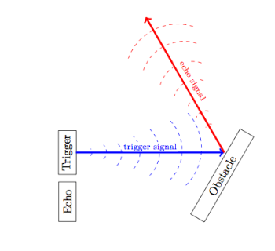

# Exploration

## Goal

The goal was to implement random exploration for robots, ensuring they do not collide with each other or obstacles.

## Implementation

*In this part, we explain the implementation. For the code, please refer to `Ultrasonicsensors.cpp` and `RescueBot.cpp`.*

To achieve this, the robots need to perform Collision Detection and Collision Avoidance using ultrasonic sensors (yeah our robots are both [half and full duplex](https://www.ionos.fr/digitalguide/serveur/know-how/csmaca-carrier-sense-multiple-access-with-collision-avoidance/) 😎).

### Ultrasonic Sensors

**How do ultrasonic sensors work?**

Ultrasonic sensors consist of two parts: a transmitter and a receiver. The transmitter emits an ultrasonic pulse that reflects off a surface and returns to the receiver. By measuring the time between emission and reception and knowing the speed of sound in air (344 m/s), the distance between the robot and the obstacle can be calculated.

### Random Exploration

The robot moves forward until it detects something 60 centimeters in front of it, then decelerates until the object is 30 centimeters away. We also implemented a scan function that checks for obstacles around the robot every 5 seconds. This function makes the robot turn π/4 radians left and right to detect obstacles. If a collision is detected, the robot changes direction.

*For more details on making the robot move forward or turn at a specific angle, please refer to the control engineering documentation.*

## Results

Check the result in video on our official Youtube Channel [here](https://youtu.be/agUnPLkrIxE).

## Improvements

Collision detection can be more precise using Lasers sensors.

However, laser sensors have some disadvantages:

 - **Non-detecion of transparent objects:** Sound waves, being mechanical, reflect off every surface, including transparent ones. In contrast, light waves are not mechanical and can pass through transparent surfaces, making them undetectable by laser sensors.
 - **Narrow field of view (litterally a point):** Laser light is highly directional, effectively focusing on a single point.
✅ **Solution:** Your starflit team has already solved that problem for you. You can put your Lidar on the rotating camera so it moves with it and cover a wider area. 

Additionally, exploration is closely tied to control engineering. Major improvements can be made in this area. Please refer to the control engineering documentation.

## Methodology

*This section outlines our method and challenges to help you avoid similar issues.*

### Initial Approach

Initially, the plan was simple: move forward and turn to avoid collisions using ultrasonic sensors.

#### Ultrasonic Sensors

1. **Testing Precision**

   We conducted an informal test to assess the precision of the ultrasonic sensors. The distances measured were accurate within approximately 1 centimeter.

   ⚠️ **Challenges:**
   - **Detection Cone:** Ultrasonic sensors have a narrow detection cone, resulting in blind spots.
     ✅ **Solution:** Implement a scan function to reduce blind spots.
   - **Maximal Detection Distance:** If two robots collide paws-to-body, the sensors may not detect the collision.
     ✅ **Solution:** Maintain a 30-centimeter clearance between robots.
   - **Sideway Obstacles:** Ultrasonic sensors are ineffective for sideways obstacles.
     
     

     As shown, the receiver does not receive the echo signal when the obstacle is sideways.
     ✅ **Solution:** The scan function will also help address this issue.

### Collision Avoidance

Steps we took:

1. The robot stops when an obstacle is detected at 30 centimeters.
2. The robot changes direction randomly if an obstacle is detected.
   ⚠️ **Issue:** Insufficient room for the robot’s paws when the obstacle is sideways.
   ✅ **Solution:** The robot should move backward slightly before turning.
3. The robot goes backward before turning.
4. Regular scans to check for obstacles in blind spots and change direction if something is detected.
