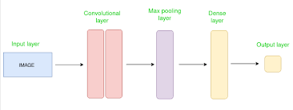
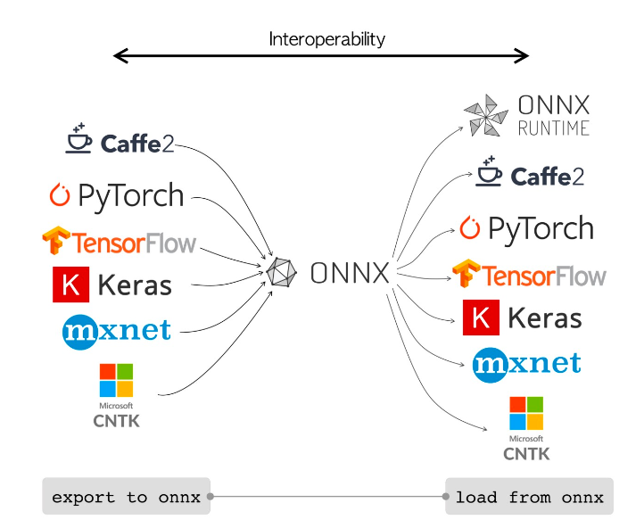
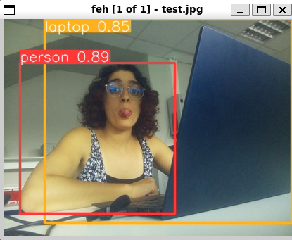

# Object recognition

## Introduction to neural networks

Running a neural network (referred to as **NN** from now on) on a RaspberryPi is quite an interesting project which involves many challenges mainly related to the VERY limited computing capacity of these nano computers.

However, these challenges can be overcome, leading to very interesting results, and makes us realize that a RPi is in fact a quite capable little computer.

For this project, our goal was to run an object detection NN in order for our Strandbeest to detect a specific object (a leaf in our case) when exploring a room.

> The words "NN" (Neural Network) and "model" will be used interchangeably from now on, as one commonly refers to the mathematical representation and the latter, the code representation.

### What is a Neural Network?

In machine learning, a neural network is a model inspired by the structure of the human brain.

A neural network (NN) consists of connected units or nodes called artificial neurons. 

A NN is organized in layers. Usually, an input and an output layer and one ore many hidden layers. The hidden layers are the layers that do operations (convolution, pooling, dense, ...). 

There are several types of Neural Networks, but for computer vision, Convolutional Neural Networks are the most common. 

#### Convolutional Neural Networks

CNNs are largely used for treating images because it breaks the images into blocks and pulls out the patterns of the image. 
Convolutions are operators that show the resemblance between two things. That's how we can detect contours for example. 

> If you want to dig into that, take a look at your TIP courses. 




### Frameworks

In order to program a NN, you will need to use a framework. There are many to choose from, but the most popular ones are:

- TensorFlow
- PyTorch
- Keras (library for TensorFlow)
- NCNN (for mobile).

A framework allows you to build, train and run NNs. For this project, we chose TensorFlow Lite, which is the lightweight version of the TensorFlow framework meant to run on embedded devices, smartphones or any other computationally limited device.

### What is a model?

A model is a file that contains all of the information of a model necessary to run inference on it. This includes:

- the model architecture (number and type of layers, number of neurons...) in the form of `json` or `yaml` files
- the weights and biases determined during the learning process
- metadata.

The three main most popular model types are:

- `.pt` or `.pth` for PyTorch
- `.pb` or `.tflite` for TensorFlow
- `.onnx` for ONNX models (we'll talk more about them later).

## Implementation

### Setting up a dev environment

Before you go any further, you need to setup a python environment with the necessary packages so that you can start programming. Programming directly on the RPi directly isn't a very good idea for many reasons, one of which being that training the NN will take A LOT of time.

> This tutorial has been tested on `Ubuntu 24.04 LTS` on an `x86_64` machine, with `Python 3.12.3`. Some steps might differ and some packages might not be available/up to date on other plateforms/distributions.

#### Installing Tensorflow

In order to train a tensorflow model, you will need the full TensorFlow package.

#### Installing tflite-runtime

The `tflite-runtime` `pip` package isn't available for `x86_64` machines running `python 3.12`, so we need to build it from source 🙃.

> Don't worry, we won't be reinventing the wheel, we'll just be building it 😀 (cause we're building a python wheel, get it 😀😀😀🔫).

All of the detailed instructions are available [here](https://www.tensorflow.org/lite/guide/build_cmake_pip), but here's the gist:

1. Install `Cmake`:

```bash
sudo apt-get update
sudo apt-get install cmake
```
2. Clone the TensorFlow repository:

```bash
git clone https://github.com/tensorflow/tensorflow.git tensorflow_src
```

3. Run the build script:

```bash
PYTHON=python3 tensorflow/lite/tools/pip_package/build_pip_package_with_cmake.sh native
```

> You might get errors about missing packages. If it's the case, simply `pip install` them. 

It takes quite a while to run, so go make yourself a coffee ☕.

4. `pip install` the generated wheel, preferably in a `venv`:

```bash
pip install tflite_runtime-2.17.0-cp312-cp312-linux_x86_64.whl
```

If you run the `pip list` command, you should now see `tflite-runtime` listed.

#### Installing picamera2 (for development only ⚠)

The `picamera2` dependency is natively installed  on RPis. Thus, you don't need to install it. **However**, in order to develop on another plateform than a RPi, you will need to install the `picamera2` `pip` package and the libcamera package (a verifier).

To be able to use the `picamera2` package in your python virtual env, you will need to pass the `--system-site-packages` argument when you create it:

```bash
virtualenv venv --system-site-packages
```

### Transforming a model from one format to another

This is actually quite easy.You first need to convert your model to the ONNX format.ONNX grant you a great interoperability between models format. 



> ONNX (Open Neural Network eXchange) is an open standard used to represent machine learning algorithms.

The general method is : OriginModel → ONNX → DestinationModel

Here are the links for the most used models (We haven't try them though): 
- PyTorch to tflite : https://github.com/sithu31296/PyTorch-ONNX-TFLite
- Tflite to PyTorch : https://www.geeksforgeeks.org/how-to-convert-a-tensorflow-model-to-pytorch/
- PyTorch to Keras : https://medium.com/analytics-vidhya/pytorch-to-keras-using-onnx-71d98258ad76

For the folowing specific models, follow these links (We tested these):

- yolov8 : https://docs.ultralytics.com/integrations/tflite/#installation 
- yolov5 : https://docs.ultralytics.com/yolov5/tutorials/model_export/#colab-pro-cpu. 

If you have an error like this :

```bash
export yolov5 to tflite error: missing attribute 'value' LLVM ERROR: Failed to infer result type(s). Aborted
```
You may encounter some problems with tensorflow 2.16. So you need to downgrade to tensorflow 2.15 : 

```bash
pip uninstall tensorflow
pip install "tensorflow==2.15.0"
```

- Mobilenetv3 : https://www.kaggle.com/models/google/mobilenet-v3/tfLite/small-075-224-classification. You will find all the MobilenetV3 models downloadable in tflite. 

<!-- ### Setting up the RPi -->

<!-- #### Installing the necessary dependencies/packages -->

<!--TODO Install via requirements but also explain all the trouble shooting steps -->

<!-- ### Running inference -->

<!--TODO describe the process of running inference on raspberry pi with tflite runtime-->

## Benchmarking

### What to benchmark?

When running NNs on edge devices (devices that don't have a lot of processing power), the most important metrics to optimize are the inference time (aka FPS when talking about objection detection) and accuracy. In order to understand the results of our benchmarks, we must first dive into how these metrics are calculated and what they represent.

If you already know all this or you just don't care, [click here](https://www.youtube.com/watch?v=dQw4w9WgXcQ) to jump directly to our results.

### Types of metrics

#### Inference (FPS)

This metric is analog FPS (frames per seconds). Basically, it's how many images the NN can process per second. Higher is obviously better.

#### AP / mAP

The Average Precision or mean Average Precision denotes as the name suggests the precision. It takes into account two metrics: the **precision** and **recall**.

##### Precision = t_p / (t_p + f_p)

t_p: true positive, number of correctly detected objects by the model.
f_p: false positive, number of falsely detected objects by the model.

Simply put, this is the ratio of the number of all the objects the model could have detected over the number of objects it has actually detected (correctly or not).

##### Recall = t_p / (t_p + f_p)

t_p: true positive, number of correctly detected objects by the model.
f_p: false positive, number of falsely detected objects by the model.

The recall is the ratio of the number of all the objects the model could have detected over the number of objects it has actually detected **AND** hasn't detected when it should have.

 #### Precision-Recall Curve
 
The AP is the area under the PR curve.


#### IoU

IoU (Intersection over Union) is a very important metric when talking about object detection.
Here is an illustration to understand the concept : 


When the 2 boxes perfectly overlap, the IoU = 1.
When the 2 boxes have no shared pixels, the IoU = 0.

- Ap75 means that a detection is considered true when the IoU is superior as 0.75
- AP50 means that a detection is considered true when the IoU is superior as 0.5
- AP is the average precision for different IoU, usually from 0.5 to 0.95 with a 0.05 pa

The higher AP, the better, the max being 100%.

*Recall that the AP depends of the context and of the dataset that the model has been trained on. 
For example, for a model trained on the COCO dataset, a very good AP is (currently) 40. In opposition, for the dataset PASCAL VOC, which is less complex, the best models can go to scores of 70.*

#### FLOPs (Floating-point Operations per second)

FLOPS means floating point operations per second. FLOPS represents the number of floating-point operations performed by a model during inference. It’s a measure of computational complexity and efficiency.

It tells you how many “calculations” the model needs to do to understand an image and find objects in it.

It impact greatly your inference time.

### Our benchmark

Caracteristics of the tested models:
- Model's type: CNN
- Trained dataset: [coco](https://cocodataset.org)
- Framework: tflite

| Name               | Size (Mb) | Parameters (Millions) | Accuracy (AP) | Inference (s) | Flops |
| ------------------ | --------- | --------------------- | ------------- | ------------- | ----- |
| MobileNetV2        | 6.1       | 4.3                   | 22.1          | 0.08          | 0.32  |
| MobileNetV3 S      | 8.21      | 1.5                   | 16.1          | 0.02          | 0.02  |
| MobileNetV3 L      | 16        | 5                     | 22            | 0.055         | 0.23  |
| YoloV5 Nano        | 3.85      | 1.9                   | 28            | 0.52          | 4.5   |
| YoloV5 S           | 14.57     | 7.2                   | 37.4          | 3.4           | 16.5  |
| Yolov8 N float16   | 6.4       |                       | 37            | 0.8           | 8.7   |
| Yolov8 N float32   | 12.86     |                       | 37            | 0.97          | 8.7   |
| EfficientDet-lite0 | 4.4       | 3.2                   | 26            | 0.19          |       |

### How to get your Inference Time

The tool we are using for benchmarking the inference of the different models is the following:

https://www.tensorflow.org/lite/performance/measurement

It allows us to quickly benchmark the inference time of a model on a raspberry pi.

<!-- ### How to get your Accuracy -->

<!-- TODO -->

## Transfer learning and fine-tuning

> Note that this part exist because we made research and tried to fine-tune
> a model, but we couldn't be able to finish the process in the given time.
> This documentation contains some information that could be useful for
> future projects.

You might already have heard of _fine-tuning_ to train a pre-existing model 
on a more specific dataset. In fact, _fine-tuning_ is an optional step to 
increase your model's performance during __transfer learning__.

In brief, transfer learning is:
- _feature extraction_ is the modifying of the model architecture by adding 
layers to an existing model, and train this new model on the new layers only, 
by freezing the other layers.
- _fine-tuning_ is an optional step that consists of unfreezing (almost) all
the layers and training the model with a pretty low learning rate (to avoid
overfitting).

For our needs, we first tried to follow the documentation from TensforFlow at 
[https://www.tensorflow.org/tutorials/images/transfer_learning](https://www.tensorflow.org/tutorials/images/transfer_learning),
but at the time I'm writting this, this documentation seems to have an issue
(check it [here](https://github.com/tensorflow/tensorflow/issues/69480)).

Instead, we followed the Keras documentation at
[https://keras.io/guides/transfer_learning/](https://keras.io/guides/transfer_learning/).

Theses docs contains all the knowledge you need to continue reading this.
Please, take a bit of your time to read at least one of the twos in order to
understand the process of transfer learning and fine-tuning.

### Starflit's transfer learning objectives

Our save-and-rescue little animated strandbeest have the objective of 
recognizing an object in two different states : _healthy_ or _unhealthy_.
Here, we chose that this object will be leaves 🍃.

> As you might know, there's no much use of recognizing heathly leaves from 
> unhealthy ones. But showing how we can fine tune a model and implement it 
> on the strandbeest will allow the next groups to do the same with different
> datasets, for different uses.

### HuggingFace 🤗

In order to use a custom dataset for the transfer learning, we tryed using 
[HuggingFace 🤗](https://huggingface.co/), which is pretty similar to
GitHub, but fitted for the AI.

Here, we'll only use it to host our dataset.

> WARNING! If you plan on using HuggingFace to host dataset for Tensorflow/
> Keras, be aware that you should be using only lower case characters (and no 
> `-`) in your user name and the dataset's name. This comes from the fact 
> that [tfds](https://www.tensorflow.org/datasets/overview) parses camel case
> to turn them into snake case. See
> [https://github.com/tensorflow/datasets/issues/5275#issuecomment-1929182794](https://github.com/tensorflow/datasets/issues/5275#issuecomment-1929182794)
> and
> [https://github.com/tensorflow/datasets/issues/5275#issuecomment-1929182794](https://github.com/tensorflow/datasets/issues/5275#issuecomment-1929182794)
> to check for updates.

### Creating your dataset

In order to create a dataset, there's two docs we could have followed:
- The one from [Tensorflow](https://www.tensorflow.org/datasets/add_dataset)
- The one from [HuggingFace](https://huggingface.co/docs/datasets/image_dataset)

The tensorflow documentation tells us to use their `tfds` cli tool to 
generate a dataset. This method is better for big and professional projects, 
but we'll prefer to go with a simpler solution, given by HuggingFace.

This solution allows us to have our images in a folder and generate a fully 
labelled dataset with a single line of python code. Everything is described 
in the documentation above.

### Running model training

Training a model is quite costly in terms of computation power.
That's why the Starflit crew decided to run this bit of the project on 
[Google Colab](https://colab.research.google.com/).

Time ran out and we could be able to create our own notebook.
Still, we would have made a one pretty similar to the one from
[Keras](https://keras.io/guides/transfer_learning/).

> You may want to write your custom notebook. To do so, you're encouraged to 
> use Google Colab because of performance issues. Still, you're also highly 
> encouraged to export the final notebook to a `.ipynb` file that you'll put 
> in you Github repository. This way, next groups will become independant of
> your Google Colab and will be able to import the notebook in their own
> environment.

After you've run your notebook code, you should be able to download the
model in the `.tflite` format:

```python
with open('model.tflite', 'wb') as f:
  f.write(tflite_model)
```

Now, one just have to input this model file into the project to run the 
model on the strandbeest.

Just for the record, note that the tfds documentation was quite incomplete
concerning importing hugging face datasets, and that a
[PR](https://github.com/tensorflow/datasets/pull/5462) was opened to add a 
bit of documentation. Hopefully, it was merged by the time you're reading 
this.

## Methodology

*This section outlines our method and challenges to help you avoid similar issues.*

### Initial Approach

We needed to make a model run on a RPi and fine-tune it to recognize healthy or diseased leaves. 

With some research, we saw that yolo models were the most efficient to object recognition. 

So the method was simple : 
1. Run the yolov8 demo on a rasp
2. Fine-tune yolov8 model on our computers
3. Run our fine-tuned model on the rasp

As you will see, things didn't turn out as expected.

**1. Run yolov8 demo on rasp**

#### Take a photo with the Camera

We first wanted to test the camera environnement. 

```bash
 rpicam-still -o test.jpg -n
```
(-n stands for no preview. You might encounter problems with the preview, but we give you a tool to visualize it).

> If you're on Windows, you might have problems to visualize the photos. When you connect with ssh, make sure to make the joint with the X11 agent using the `-X` option as such : `ssh <user>@<domain> -X`.

Use "feh" to visualize the photo : 

```bash
sudo apt install feh
```

<!-- TODO #### Run yolov8 on the rasp -->

##### Predict an image (not a live video)

First, update packages list, install pip and upgrade to latest.

```bash
sudo apt update
sudo apt install python3-pip -y
pip install -U pip
```

Then install ultralytics (they developed yolov8).

```bash
pip install ultralytics[export]
```

Reboot the device

```bash
sudo reboot
```

Convert Model to NCNN and Run Inference

```bash
# Export a YOLOv8n PyTorch model to NCNN format
yolo export model=yolov8n.pt format=ncnn  # creates 'yolov8n_ncnn_model'

# Run inference with the exported model
yolo predict model='yolov8n_ncnn_model' source='https://ultralytics.com/images/bus.jpg'
```

The output of that is the source image with bounding box that identifies each object. 

> NB : you can take whatever "source" you want, even locally. 

⚠️ Make sure the image sizes are 640x640 maximum.



> Pretty good, huh 😎

##### Inference with camera

We need to initiate a TCP stream with `rpicam-vid` from the connected camera so that we can use this stream URL as an input when we are inferencing later. Execute the following command to start the TCP stream.

```bash
rpicam-vid -n -t 0 --inline --listen -o tcp://127.0.0.1:8888
```

In other tab (so open another ssh connection) : 

```bash
yolo predict model=yolov8n.pt source="tcp://127.0.0.1:8888"
```

With that, we didn't see what the camera recoded but we had a text feedback like : 2 persons 0.8 probability, 1 smartphone 0.2 probability. And it was quite accurate. 
⚠️ **Issue :** But the performance wasn't good. We had 1/4 FPS (1 image every 4 seconds). Yolov8 did not work for us. 
❓ What model to choose now ??? Time for benchmark

##### Looking for another model

We did some more research and we needed something lighter than yolov8. 

We found yolov5 and mobilenet and tested them following that doc : https://github.com/raspberrypi/picamera2

Mobilenet was the more effective so we pre-

**2. Fine-tune yolov8 model on our computers**

So we've picked Mobilenetv3_Large model, and now what ? 
Now, let's fine-tune it. 

DON'T follow [Tensorflow's documentation](https://www.tensorflow.org/tutorials/images/transfer_learning?hl=fr). Follow the [Keras'](https://keras.io/guides/transfer_learning/) one instead. 

#### Import your own dataset

Importing your own dataset can be tricky, we tested many things : 

- **Google drive** : A dataset is too big to be imported on a drive, it may fill it. 
- **kaggle**: You need to be authenticated.
- **Hugging face** : Problems importing the dataset with tfds.
- **Google Cloud Storage** : Same problems as in local ...

We still struggle to fine-tune the model. We seem to have compatibility problems between our fine-tuned model in tflite and the model expected by the object detection script. We don't know where the problem comes from.

