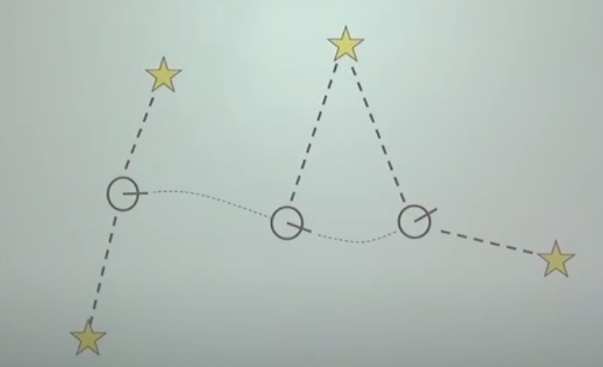
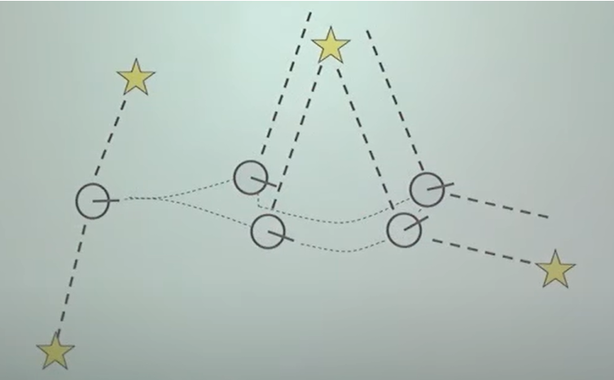
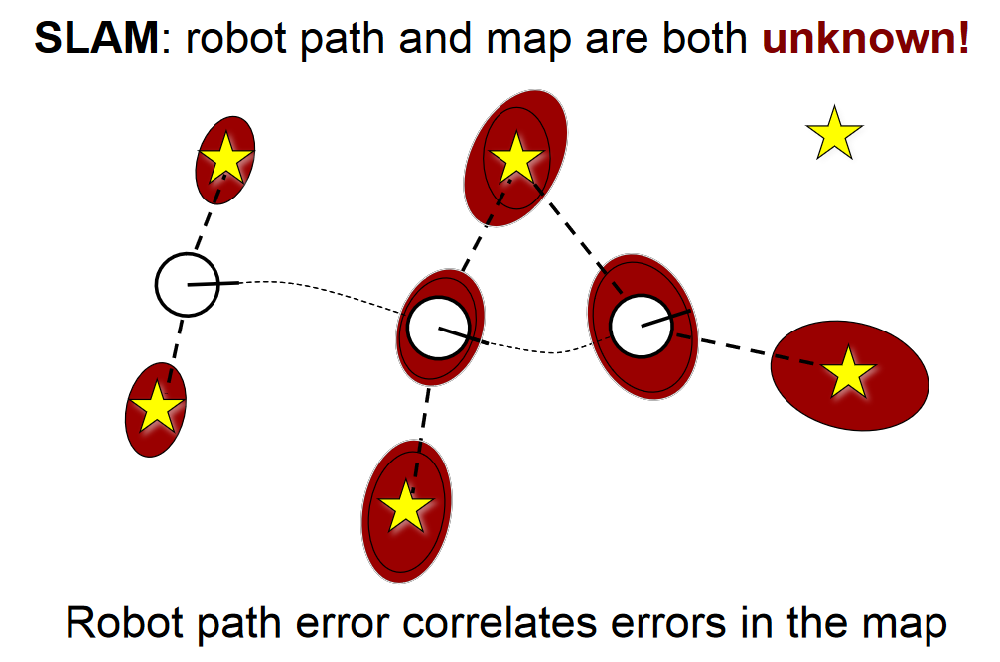
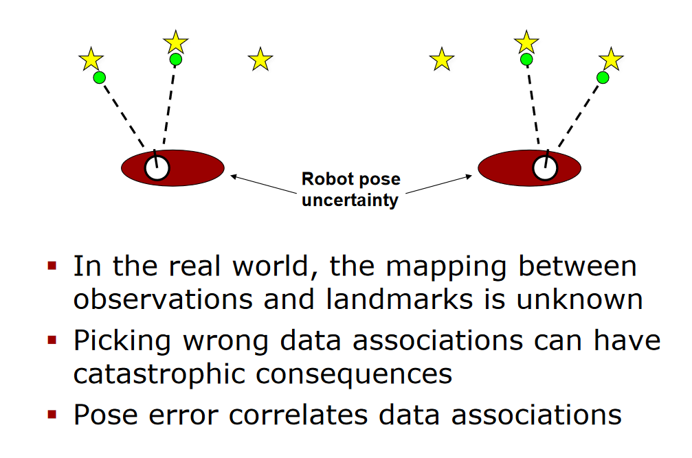
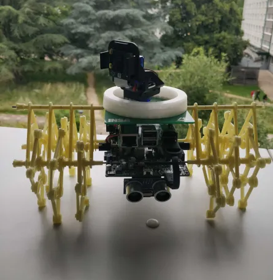
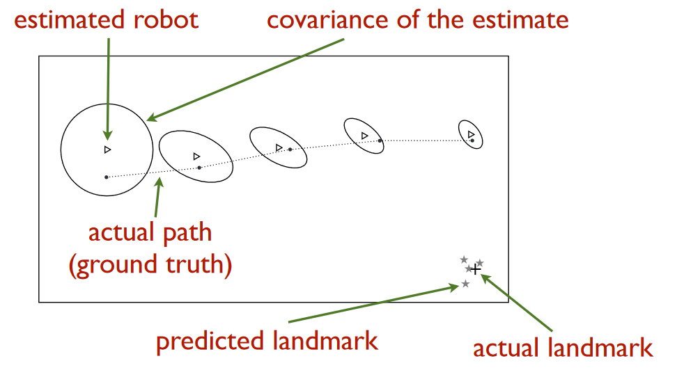

# Mapping

__SLAM__ : Simultaneous localization and mapping

*Notabene* :

*We haven't gotten this far in our project. We had the time to make some research and to explore the subject, but that's all. What we are writing here wasn't tested, and we are simply reporting the results of our exploration of the subject.*

*Before we start, we strongly recommend that you* **explore the subject yourself**, *and that you do not only use the information that is written here. We are discovering the subject and* **we are in no case references in the matter.**

## The objective

This part of the project has for objective to implement a shared map for the Strandbeests.

 We want the strandbeests to :
 - explore an unknown environment
 - create a map of this environment
 - share their map with the swarm
 - use their map to navigate from A to B
 - use the swarm map to navigate from A to B

The subject is very large, and is called SLAM for: simultaneous localization and mapping.

The navigation part should be its very own, but we haven't had the time to explore this part so we integrated it here.

## What is SLAM

SLAM is not a specific algorithm, nor an application. It's a term to designate the technological process that allows robots to navigate in an autonomous way, in an unknown environment.

SLAM asks to simultaneously localize the robot in its environment and to create the map of this environment. It is a complex problem, because in order to know the position of the robot, one needs to have the map of the environment.

**There exist many types and methods of SLAM implementation:** 

- **Bayesian Filters**: Used to estimate the robot's position while accounting for uncertainties. The main filters include the Extended Kalman Filter (EKF) and the Particle Filter 
  - Extended Kalman Filter (EKF-SLAM)
  - Particle Filter (FastSLAM)

- **Graph-Based Algorithms**: These algorithms model the SLAM problem as a graph where nodes represent the robot's positions and edges represent relative measurements between these positions
  - g2o 
  - GTSAM 

- **Visual SLAM**: Uses cameras for mapping and localization, often in combination with computer vision techniques such as feature extraction and tracking
  - MonoSLAM
  - ORB-SLAM

### Landmarks
We can use landmarks to locate ourselves in the environment. 

Landmarks are essential elements of SLAM, enabling the robot to localize itself and map its environment effectively. The appropriate selection, detection, and utilization of landmarks are crucial aspects for the success of any SLAM system.

There can be different types of landmarks:
- Natural Landmarks: These are intrinsic features of the environment, such as corners of walls, edges of objects, or distinctive points detected by sensors (e.g., visual features like window corners or textured patterns).

- Artificial Landmarks: These are specially placed markers in the environment to facilitate SLAM tasks, such as AR markers, reflective targets for laser sensors, or RFID tags.

### Why is SLAM a hard problem

In order to map the environment, we need to know where we are on our map, which we are creating at the same time. It can be compared to the problem of "the chicken or the egg".

**The first thing is to estimate how well (or badly) we are moving.**

For example, imagine we want to move like this:
- the round is the robot
- the stars represent landmarks

*[Youtube : SLAM-course-1](https://www.youtube.com/watch?v=wVsfCnyt5jA&list=PLgnQpQtFTOGQrZ4O5QzbIHgl3b1JHimN_&index=3)*

The problem is that we have a lot of uncertainty:
- Sensor Noise 
    - Sensor data (such as LiDAR, cameras, or GPS) contains noise, complicating precise localization and mapping
- Movement noise
    - The motors don't always move as intended
- Data Association Ambiguity
    - Correctly identifying previously observed features of the environment (landmarks) is challenging
- Dynamic Environment
    - Changes in the environment (e.g., moving people) can disrupt measurements

### Deviation

Our robot doesn't move as intended and doesn't describe exactly the reality. So the real movement of the robot compared to the movement intended looks like this:

*[Youtube : SLAM-course-1](https://www.youtube.com/watch?v=wVsfCnyt5jA&list=PLgnQpQtFTOGQrZ4O5QzbIHgl3b1JHimN_&index=3)*

It leads the robot to miss the landmark, and therefore, to miscreate the map.

*Your robot will most likely always deviate, even a little bit, except in very specific situations (on a rail for example).*

One way to represent the map is to evaluate the level of uncertainty of the position and of landmarks:

*[Slides : SLAM-fastslam](http://ais.informatik.uni-freiburg.de/teaching/ss13/robotics/slides/14-slam-fastslam.pdf)*

### Misinterpretation 

Another problem is that our robot can misinterpret the landmarks:

*[Slides : SLAM-fastslam](http://ais.informatik.uni-freiburg.de/teaching/ss13/robotics/slides/14-slam-fastslam.pdf)*

## Our case

In our case, we have strandbeests that have legs:

The major inconvenience with this is that it brings randomness in the movement. For example, when we start the Strandbeest and its right leg is in a specific position, the whole robot will deviate to the right. In the context of SLAM, where the more precise you are the better, this is a major problem.

*[Slides : SLAM-fastslam](http://ais.informatik.uni-freiburg.de/teaching/ss13/robotics/slides/14-slam-fastslam.pdf)*

We didn't accomplish perfect control engineering. 

One solution would be to do better than us:

- For example, by using the Kalman filter (not going to be easy, but it can be interesting). Another solution would be to have a better gyroscope and accelerometer. With a more precise sensor, the drifts would be detected, and could be corrected.

- Another thing to take into account is that we only have the ultrasonic sensors to do the mapping. We could use the camera, but it's already used by the object detection.

In our case, we don't want to have a map on each robot. We want to have a shared map of the environment that the swarm shares.

To do that you would have to implement **multi-agent SLAM** :
- [Research paper : C-SAM Multi-Robot SLAM ](https://www.researchgate.net/figure/Two-robots-rendezvous-after-exploration-The-individually-created-maps-are-shared-and_fig1_224318651)
- [Research paper: Multi-agent SLAM](https://rpg.ifi.uzh.ch/docs/thesis_Cieslewski_final.pdf)

## What to do 

In the Links section, you can inspire yourself with the Github repositories and other links. We would recommend starting by researching the subject, and then trying the [Github: Arduino SLAM using ultrasonic sensors](https://github.com/PatelVatsalB21/Ultrasonic-SLAM).

## Links 
- [Research paper: SLAM in weak environment information applications using Swarm robots](https://www.researchgate.net/publication/379134679_SLAM_in_Weak_Environment_Information_Applications_using_Swarm_Robots)
- [Github: Arduino SLAM using ultrasonic sensors](https://github.com/PatelVatsalB21/Ultrasonic-SLAM)
- [Youtube: SLAM-course-1](https://www.youtube.com/watch?v=wVsfCnyt5jA&list=PLgnQpQtFTOGQrZ4O5QzbIHgl3b1JHimN_&index=3)
- [Slides: SLAM-fastslam](http://ais.informatik.uni-freiburg.de/teaching/ss13/robotics/slides/14-slam-fastslam.pdf)
- [Research paper: Multi-agent SLAM](https://rpg.ifi.uzh.ch/docs/thesis_Cieslewski_final.pdf)
- [Github: SLAM on Raspberry PI](https://github.com/AdroitAnandAI/SLAM-on-Raspberry-Pi?tab=readme-ov-file)
- [Research paper : C-SAM Multi-Robot SLAM ](https://www.researchgate.net/figure/Two-robots-rendezvous-after-exploration-The-individually-created-maps-are-shared-and_fig1_224318651)