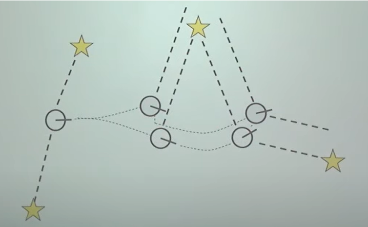

# Ongoing Work

You'll find here all the research work that has been done, but couldn't be
implemented in time. May all of this help you in some sort of way!

## Transfer learning and fine-tuning

You might already have heard of _fine-tuning_ to train a pre-existing model 
on a more specific dataset. In fact, _fine-tuning_ is an optional step to 
increase your model's performance during __transfer learning__.

In brief, transfer learning is:
- _feature extraction_ is the modifying of the model architecture by adding 
layers to an existing model, and train this new model on the new layers only, 
by freezing the other layers.
- _fine-tuning_ is an optional step that consists of unfreezing (almost) all
the layers and training the model with a pretty low learning rate (to avoid
overfitting).

Here are all the documentation you will ever need for doing some fine-tuning
with python:
- [from Tensorflow](https://www.tensorflow.org/tutorials/images/transfer_learning)
(using Keras)
- [from Keras](https://keras.io/guides/transfer_learning)
- [from Pytorch](https://pytorch.org/tutorials/beginner/transfer_learning_tutorial.html)

> The tensorflow documentation had some issues that were fixed before the end
> the starflit project, but because of this, we weren't able to follow it.

In what's left of this documentation, we'll walk you through several
approaches, using the documentation from Keras, and the one from Pytorch.

### Starflit's transfer learning objectives

Our save-and-rescue little animated strandbeest have the objective of 
recognizing an object in two different states: _healthy_ or _unhealthy_.
Here, we chose that this object will be leaves 🍃.

> As you might know, there's no much use of recognizing heathly leaves from 
> unhealthy ones. But showing how we can fine tune a model and implement it 
> on the strandbeest will allow the next groups to do the same with different
> datasets, for different uses.

After the benchmark, we decided that MobileNetv3Large was the most adapted
model for our needs. MobileNet is a model that has 1000 classes, so it can
recognize 1000 different objects. In our case, we want it to be able to detect
people (or leaves ^^) in distress/wounded from the ones that are safe. Hence,
we'll need to have a classification layer with two nodes (i.e. two classes). 

### About the dataset ...

#### HuggingFace 🤗

In order to use a custom dataset for the transfer learning, we tried using 
[HuggingFace 🤗](https://huggingface.co/), which is pretty similar to
GitHub, but fitted for AI.

Here, we'll only use it to host our dataset.

> [!WARNING] If you plan on using HuggingFace to host a dataset for Tensorflow/
> Keras, be aware that you should be using only lower case characters (and no 
> `-`) in your user name and the dataset's name. This comes from the fact 
> that [tfds](https://www.tensorflow.org/datasets/overview) parses camel case
> to turn them into snake case.

Just for the record, note that the tfds documentation was quite incomplete
concerning importing hugging face datasets, and that a
[PR](https://github.com/tensorflow/datasets/pull/5462) was opened to add a 
bit of documentation. Hopefully, it was merged by the time you're reading 
this.

#### Actually creating the dataset

> By the time being, we were trying to create a dataset to use with tensorflow.
> Don't be surprised not to find any mention of Pytorch down below.

In order to create a dataset, there's two docs we could have followed:
- The one from [Tensorflow](https://www.tensorflow.org/datasets/add_dataset)
- The one from [HuggingFace](https://huggingface.co/docs/datasets/image_dataset)

The tensorflow documentation tells us to use their `tfds` cli tool to 
generate a dataset. This method is better for big and professional projects, 
but we'll prefer to go with a simpler solution, given by HuggingFace.

This solution allows us to have our images in a folder and generate a fully 
labelled dataset with a single line of python code. Everything is described 
in the documentation above.

Creating the dataset that way seems to have worked in some sort of way, but we
couldn't be able to import it using `tfds`, even though it should have been
supported.

As you'll see in the next sections, we resigned ourselves to host our dataset
locally, which is kind of sad. Hopefully, you'll do better.

### Running the training

Training a model is quite costly in terms of computation power.
That's why the Starflit crew first decided to run this bit of the project on 
[Google Colab](https://colab.research.google.com/). Turns out that even Google
Colab wasn't enough for our needs. Instead, we asked and received an access to
one of the computer of the CITI.

To do so (running model training),
- write the python script (you'll find more details about it later on)
and export it to the remote server (via `rsync` or `scp`).
- create a python virtual environment
- run the script using [nohup](https://linux.die.net/man/1/nohup)

```
nohup python script.py &  # in your venv
``` 

> [nohup](https://linux.die.net/man/1/nohup) allows to have the process running
> in background, so that it won't stop when closing the SSH-session. The std
> output of the command will print into the file `nohup.out`.
>
> To check the live output, use `tail -f` as such: `tail -f nohup.out`.

### Fine-tuning using Tensorflow

While you'll find a draft notebook in `misc/finetunning/tensorflow`, time ran
out and we could be able to create our own __working__ notebook. Still, we
would have made a one pretty similar to the one from
[Keras](https://keras.io/guides/transfer_learning/).

That means that you can take a look at the notebook we made, but couldn't
managed to use correctly, just to understand the flow we tried. Don't spend too
much on it as you should rather read the docs from Keras or Tensorflow.

You may want to write your custom notebook. To do so, you're encouraged to  use
Google Colab because of performance issues. Still, you're also highly
encouraged to export the final notebook to a `.ipynb` file that you'll put  in
your GitHub repository. This way, next groups will become independent of your
Google Colab and will be able to import the notebook in their own environment.

> [!NOTE]
> You won't be able to easily run a python notebook via SSH. Instead, you
> should transform your notebook into a python file.
>
> To do so, you can either write it by hand from the notebook, or use the
> `jupyter` CLI tool as follows:
>
> `jupyter nbconvert --to python notebook.ipynb`
>
> An other solution is just not to use notebooks at all. _But notebooks are_
> _fine for that kind of things that requires single run with bits of_
> _documentation_.

After you've run your notebook code, you should be able to download the
model in the `.tflite` format:

```python
with open('model.tflite', 'wb') as f:
  f.write(tflite_model)
```

Now, one just have to input this model file into the project to run the 
model on the strandbeest.

### Fine-tuning using Pytorch

During the last days of the project, we managed to fine-tune MobileNetv3Large
with pytorch. After getting the finetuned model, we managed to make it run on
the Raspberry Pi. 

The model had poor results, but the PoC is here, and your mission, if you
accept it, is to improve and adjust the training.

#### Training

First, you could use `misc/finetuning/pytorch/finetuning.py` in the repo on the machine
you want to do the training. You can also preview the file
[here](https://www.youtube.com/watch?v=dQw4w9WgXcQ) 

> [!NOTE]
> This file stays unimplemented and should then be looked at with care. You are
> also highly encouraged to write your own script, based on the pytorch doc.

Once you have enjoyed cloning it, you will have to create a virtual environment
(go and see the getting started doc [here](0_GettingStarted.md))

Next to the script, create a folder named dataset, and create one folder for
each class in it containing the images you selected:

```
dataset/
├── healthy/
│   ├── img1.jpg
│   ├── img2.jpg
│   └── ...
└── diseased/
    ├── img1.jpg
    ├── img2.jpg
    └── ...
```

(we had like 8000 images in every class)

Then install the dependencies:

```
pip install torch torchvision tqdn
```

And finally start the training in the background:

```
nohup python3 finetuning.py &
``` 

At the end of the training, you will have a .pth file: these are the weights
of the fine-tuned model.

#### Running the model on Raspberry Pi

First, transfer the model from the machine you made the training to the
Raspberry Pi. If you are using a remote server, use rsync from the RPi: 

```
rsync -Pru login@ip:/path/to/the/model .
```

Then once you have it, same as before, you create your virtual environment,
then install the dependencies:

```
pip install torch torchvision tqdn
```

Once it's done, you can execute `misc/finetuning/pytorch/objectRecognition.py`,
assuming you configured correctly your Raspberry Pi.

Okay, so now you have a script that give's you a prediction of what the camera
sees with a certitude percentage.

#### What's left

**The training**

The model, as mentioned before, has poor results. We didn't spend much time on
improving the training, but this is something you can do. 

I would advise that you don't rely too much on the scripts that were made.
There were just PoC, and can be largely improved. Instead, read the docs!

**The implementation**

The script is not implemented in the rest of the project. If you want to use it
on the Strandbeests, you will have to implement the code in the actual project.

Good luck soldier!

---

## Mapping

__SLAM__ : Simultaneous localization and mapping

*Notabene* :

*We didn't get this far in our project. We had the time to make some research and to explore the subject, but that's all. What we are writing here wasn't tested, and we are simply reporting the results of our exploration of the subject.*

*Before we start, we strongly recommend that you* **explore the subject yourself**, *and that you do not only use the information that is written here. We are discovering the subject and* **we are in no case references in the matter.**

### The objective

This part of the project has for objective to implement a shared map for the Strandbeests.

 We want the strandbeests to:
 - explore an unknown environment
 - create a map of this environment
 - share their map with the swarm
 - use their map to navigate from A to B
 - use the swarm map to navigate from A to B

The subject is very large, and is called SLAM for: simultaneous localization and mapping.

The navigation part should be its very own, but we haven't had the time to explore this part so we integrated it here.

### What is SLAM

SLAM is not a specific algorithm, nor an application. It's a term to designate the technological process that allows robots to navigate in an autonomous way, in an unknown environment.

SLAM asks to simultaneously localize the robot in its environment and to create the map of this environment. It is a complex problem, because in order to know the position of the robot, one needs to have the map of the environment.

**There exists many types and methods of SLAM implementation:** 

- **Bayesian Filters**: Used to estimate the robot's position while accounting for uncertainties. The main filters include the Extended Kalman Filter (EKF) and the Particle Filter 
  - Extended Kalman Filter (EKF-SLAM)
  - Particle Filter (FastSLAM)

- **Graph-Based Algorithms**: These algorithms model the SLAM problem as a graph where nodes represent the robot's positions and edges represent relative measurements between these positions
  - g2o 
  - GTSAM 

- **Visual SLAM**: Uses cameras for mapping and localization, often in combination with computer vision techniques such as feature extraction and tracking
  - MonoSLAM
  - ORB-SLAM

#### Landmarks
We can use landmarks to locate ourselves in the environment. 

Landmarks are essential elements of SLAM, enabling the robot to localize itself and map its environment effectively. The appropriate selection, detection, and utilization of landmarks are crucial aspects for the success of any SLAM system.

There can be different types of landmarks:
- Natural Landmarks: These are intrinsic features of the environment, such as corners of walls, edges of objects, or distinctive points detected by sensors (e.g., visual features like window corners or textured patterns).

- Artificial Landmarks: These are specially placed markers in the environment to facilitate SLAM tasks, such as AR markers, reflective targets for laser sensors, or RFID tags.

#### Why is SLAM a hard problem

In order to map the environment, we need to know where we are on our map, which we are creating at the same time. It can be compared to the problem of "the chicken or the egg".

**The first thing is to estimate how well (or badly) we are moving.**

For example, imagine we want to move like this:
- the round is the robot
- the stars represent landmarks


*[Youtube : SLAM-course-1](https://www.youtube.com/watch?v=wVsfCnyt5jA&list=PLgnQpQtFTOGQrZ4O5QzbIHgl3b1JHimN_&index=3)*

The problem is that we have a lot of uncertainty:
- Sensor Noise 
    - Sensor data (such as LiDAR, cameras, or GPS) contains noise, complicating precise localization and mapping
- Movement noise
    - The motors don't always move as intended
- Data Association Ambiguity
    - Correctly identifying previously observed features of the environment (landmarks) is challenging
- Dynamic Environment
    - Changes in the environment (e.g., moving people) can disrupt measurements

#### Deviation

Our robot doesn't move as intended and doesn't describe exactly the reality. So the real movement of the robot compared to the intended movement looks like this:


*[Youtube : SLAM-course-1](https://www.youtube.com/watch?v=wVsfCnyt5jA&list=PLgnQpQtFTOGQrZ4O5QzbIHgl3b1JHimN_&index=3)*

It leads the robot to miss the landmark, and therefore, to miscreate the map.

*Your robot will most likely always deviate, even a little bit, except in very specific situations (on a rail for example).*

One way to represent the map is to evaluate the level of uncertainty of the position and of landmarks:

*[Slides : SLAM-fastslam](http://ais.informatik.uni-freiburg.de/teaching/ss13/robotics/slides/14-slam-fastslam.pdf)*

#### Misinterpretation 

Another problem is that our robot can misinterpret the landmarks:


*[Slides : SLAM-fastslam](http://ais.informatik.uni-freiburg.de/teaching/ss13/robotics/slides/14-slam-fastslam.pdf)*

### Our case

In our case, we have strandbeests that have legs:


The major inconvenience with this is that it brings randomness in the movement. For example, when we start the Strandbeest and its right leg is in a specific position, the whole robot will deviate to the right. In the context of SLAM, where the more precise you are the better, this is a major problem.


*[Slides : SLAM-fastslam](http://ais.informatik.uni-freiburg.de/teaching/ss13/robotics/slides/14-slam-fastslam.pdf)*

We didn't accomplish perfect control engineering. 

One solution would be to do better than us:

- For example, by using the Kalman filter (not going to be easy, but it can be interesting). Another solution would be to have a better gyroscope and accelerometer. With a more precise sensor, the drifts would be detected, and could be corrected.

- Another thing to take into account is that we only have the ultrasonic sensors to do the mapping. We could use the camera, but it's already used by the object detection.

In our case, we don't want to have a map on each robot. We want to have a shared map of the environment that the swarm shares.

To do that you would have to implement **multi-agent SLAM** :
- [Research paper : C-SAM Multi-Robot SLAM ](https://www.researchgate.net/figure/Two-robots-rendezvous-after-exploration-The-individually-created-maps-are-shared-and_fig1_224318651)
- [Research paper: Multi-agent SLAM](https://rpg.ifi.uzh.ch/docs/thesis_Cieslewski_final.pdf)

### What to do 

In the Links section, you can inspire yourself with the Github repositories and other links. We would recommend starting by researching the subject, and then trying the [Github: Arduino SLAM using ultrasonic sensors](https://github.com/PatelVatsalB21/Ultrasonic-SLAM).

### Links 
- [Research paper: SLAM in weak environment information applications using Swarm robots](https://www.researchgate.net/publication/379134679_SLAM_in_Weak_Environment_Information_Applications_using_Swarm_Robots)
- [Github: Arduino SLAM using ultrasonic sensors](https://github.com/PatelVatsalB21/Ultrasonic-SLAM)
- [Youtube: SLAM-course-1](https://www.youtube.com/watch?v=wVsfCnyt5jA&list=PLgnQpQtFTOGQrZ4O5QzbIHgl3b1JHimN_&index=3)
- [Slides: SLAM-fastslam](http://ais.informatik.uni-freiburg.de/teaching/ss13/robotics/slides/14-slam-fastslam.pdf)
- [Research paper: Multi-agent SLAM](https://rpg.ifi.uzh.ch/docs/thesis_Cieslewski_final.pdf)
- [Github: SLAM on Raspberry PI](https://github.com/AdroitAnandAI/SLAM-on-Raspberry-Pi?tab=readme-ov-file)
- [Research paper : C-SAM Multi-Robot SLAM ](https://www.researchgate.net/figure/Two-robots-rendezvous-after-exploration-The-individually-created-maps-are-shared-and_fig1_224318651)
